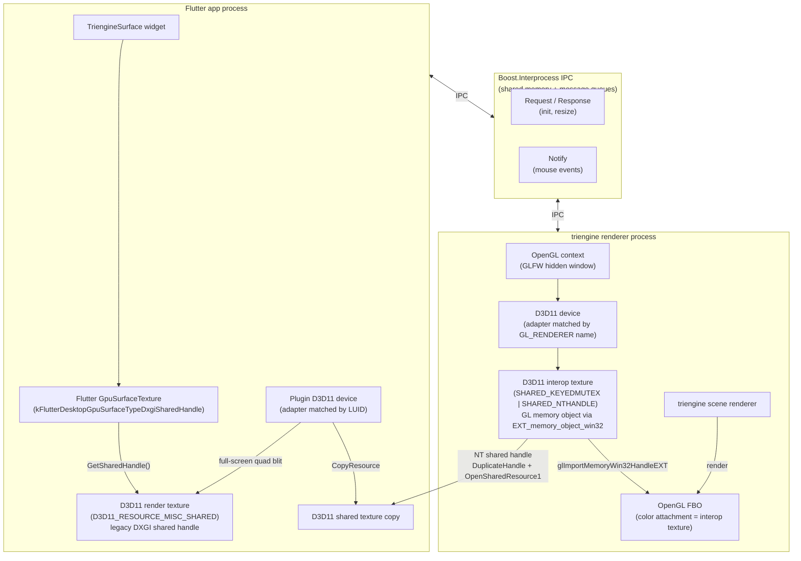
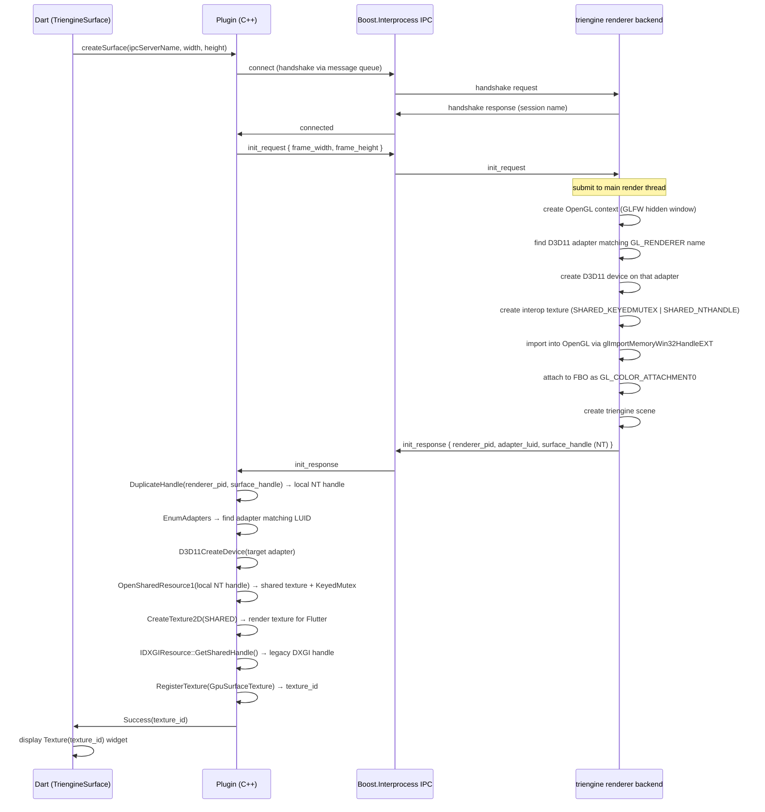
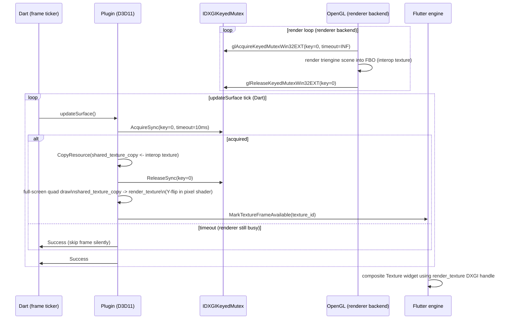
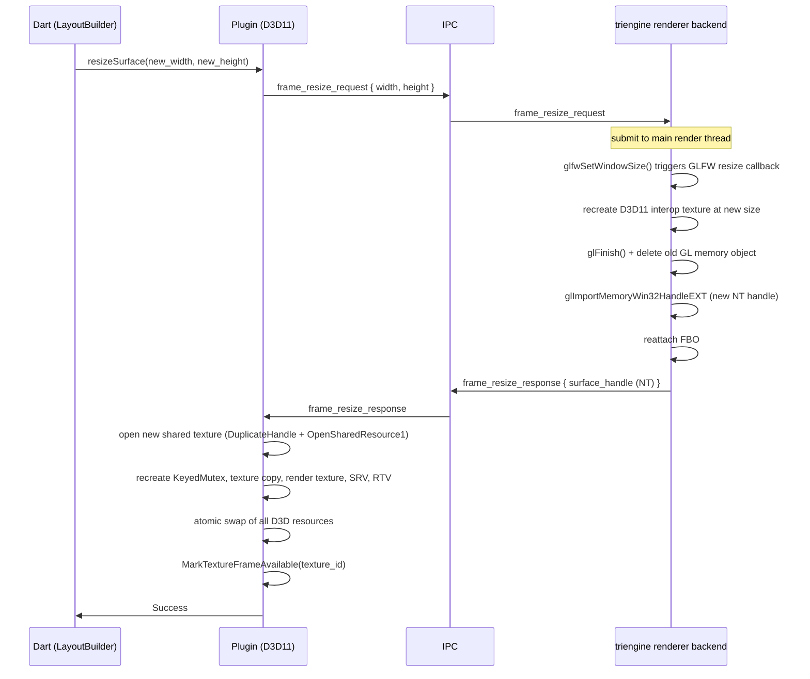
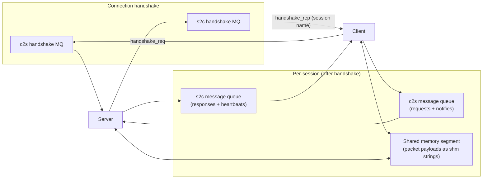
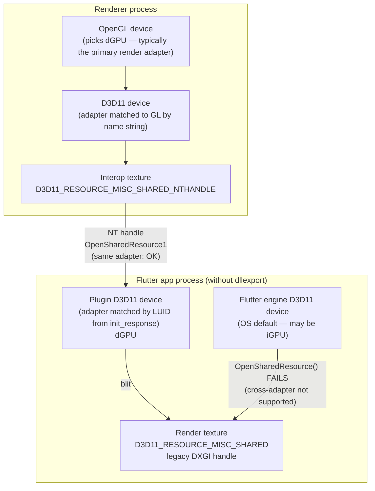

# triengine_interop_flutter

A Flutter Windows plugin that embeds a [triengine](https://github.com/xorespesp/triengine) 3D scene — rendered offscreen by a separate native process — directly into a Flutter widget tree as a live texture.

> **triengine** is an OpenGL-based 3D graphics engine.  
> Because Flutter on Windows uses Direct3D 11 internally, bridging an OpenGL renderer into Flutter requires a cross-API GPU texture sharing pipeline.  
> This plugin implements that bridge.

---

## Architecture



### Key design points

- The D3D11 interop texture lives in the renderer process. It is the **shared render target between OpenGL and D3D11**, backed by the same physical GPU memory. OpenGL renders into it via an FBO; the plugin reads it via `OpenSharedResource1`.
- The plugin cannot hand the interop texture directly to Flutter because it uses an NT handle (`SHARED_NTHANDLE`), and the Flutter engine expects a legacy DXGI handle (`SHARED`). The plugin therefore blits the interop texture into a separate render texture that carries a legacy DXGI handle, and passes that handle to Flutter.
- Frame-level synchronization between the OpenGL writer and the D3D11 reader is done via `IDXGIKeyedMutex` / `GL_EXT_win32_keyed_mutex`, both operating on key `0`.

---

## Initialization



---

## Per-frame rendering



### Y-axis flip

OpenGL uses a bottom-left coordinate origin; Direct3D uses top-left. The plugin's pixel shader flips the Y axis when blitting `shared_texture_copy` into `render_texture`, so the image appears correctly in Flutter.

---

## Resize



---

## Mouse event forwarding

Mouse input from the Flutter widget is forwarded to the renderer as fire-and-forget IPC notify packets. The renderer uses them to drive the triengine scene camera.

| Dart method | Packet type | Payload |
|---|---|---|
| `sendMouseButtonEvent` | `mouse_button_event` | x, y, button, action, mods |
| `sendMouseMoveEvent` | `mouse_move_event` | x, y, mods |
| `sendMouseScrollEvent` | `mouse_scroll_event` | yoffset |

Camera behavior driven by these events: left-drag = orbit, middle-drag = pan, scroll = zoom.

---

## IPC transport details

The plugin and renderer backend communicate via **Boost.Interprocess**: a named shared memory segment plus per-session message queues. No network sockets or named pipes are involved.



Packet types at the session layer:

| Type | Direction | Purpose |
|---|---|---|
| `request` | client -> server | `init`, `resize` (expects a `response`) |
| `response` | server -> client | reply to a `request`, matched by packet ID |
| `notify` | client -> server | mouse events (no reply expected) |
| `heartbeat` | both | liveness; sent every 5 s, timeout after 20 s |
| `disconnect` | both | graceful teardown |

Packet payloads at the application layer (`ipc_proto`):

```
init_request        { frame_width, frame_height }
init_response       { renderer_process_id, target_adapter_luid, surface_handle }
frame_resize_request  { width, height }
frame_resize_response { surface_handle }
mouse_button_event  { x, y, button, action, mods }
mouse_move_event    { x, y, mods }
mouse_scroll_event  { yoffset }
```

---

## GPU adapter requirement (critical)

The Flutter app's `windows/runner/main.cpp` **must** export `NvOptimusEnablement` and `AmdPowerXpressRequestHighPerformance`. Without this, the Flutter engine may run on the iGPU while the renderer uses the dGPU, and texture sharing will silently fail.

### Why this matters



The legacy DXGI shared handle (`D3D11_RESOURCE_MISC_SHARED`, obtained via `IDXGIResource::GetSharedHandle()`) can only be opened by a D3D11 device on the **same GPU adapter** as the device that created it. If Flutter's internal D3D11 device is on a different adapter, `OpenSharedResource()` fails and Flutter logs:

```
[ERROR:flutter/shell/platform/windows/external_texture_d3d.cc(107)] Binding D3D surface failed.
```

The widget shows nothing. No Dart-level exception is raised.

Note: the interop texture between the renderer and the plugin uses `D3D11_RESOURCE_MISC_SHARED_NTHANDLE` and is opened via `OpenSharedResource1` — this supports cross-process sharing but still requires both devices to be on the same adapter.

### Fix

Add the following to `windows/runner/main.cpp` at file scope, before `wWinMain`:

```cpp
// Force the high-performance GPU (dGPU).
//
// triengine's offscreen_renderer_dx selects the GPU adapter by matching
// the OpenGL renderer name string against DXGI adapter descriptions.
// On a system with dGPU + iGPU this will be the dGPU. The plugin creates
// its D3D11 device on the same adapter (identified by LUID from the IPC
// init_response). The Flutter-facing render texture uses a legacy DXGI
// shared handle (D3D11_RESOURCE_MISC_SHARED), which only works when
// Flutter's own D3D11 device is on the same adapter.
// These symbols instruct the NVIDIA/AMD driver to assign this process to
// the high-performance GPU at startup.
extern "C" {
__declspec(dllexport) DWORD NvOptimusEnablement = 1;
__declspec(dllexport) DWORD AmdPowerXpressRequestHighPerformance = 1;
}
```

---

## Required OpenGL extensions (renderer backend)

The following extensions must be supported by the GPU driver used by the triengine backend:

| Extension | Purpose |
|---|---|
| `GL_EXT_memory_object` | import external GPU memory objects into OpenGL |
| `GL_EXT_memory_object_win32` | import via Win32 NT handles (`GL_HANDLE_TYPE_D3D11_IMAGE_EXT`) |
| `GL_EXT_win32_keyed_mutex` | synchronize with D3D11 via `IDXGIKeyedMutex` |

`offscreen_renderer_dx` panics at startup if any of these extensions are missing.

---

## Platform support

Windows only. Requires Direct3D 11 and the OpenGL extensions listed above.

| Platform | Supported |
|---|---|
| Windows | yes |
| macOS / Linux / Android / iOS | no |

---

## Usage

```dart
import 'package:triengine_interop_flutter/triengine_surface_widget.dart';

TriengineSurface(
  rendererIpcServerName: 'your-ipc-server-name',
  size: Size(width, height),
  devicePixelRatio: View.of(context).devicePixelRatio,
)
```

`TriengineSurface` manages the full surface lifecycle:
- `createSurface` on widget mount
- `updateSurface` each frame tick
- `resizeSurface` on layout change
- `destroySurface` on widget unmount

For a complete renderer backend implementation, see `examples/example-interprocess` in the triengine repository.
